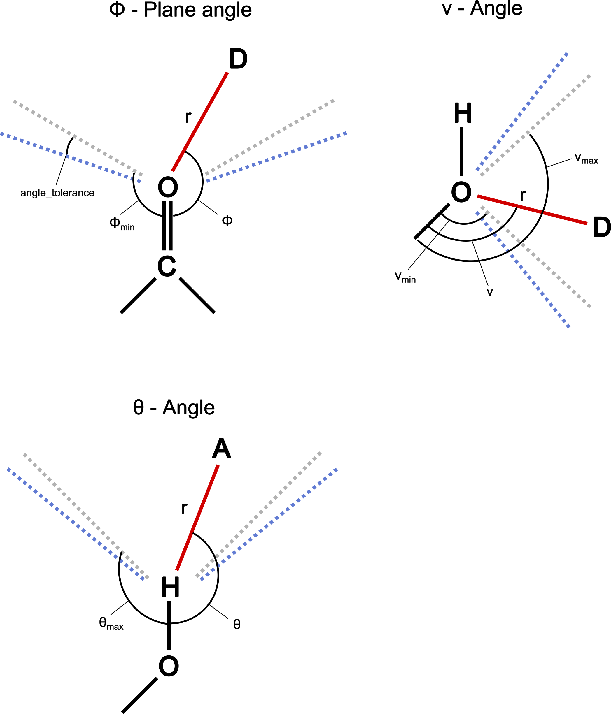
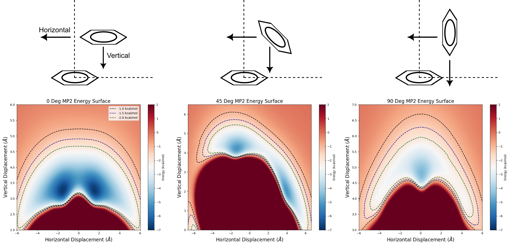
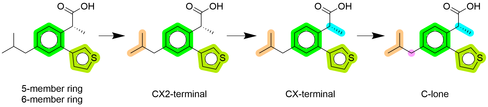

Interactions
=============================

Hydrogen bonds
-----------------

Hydrogen Bond and angle definition are taken from:
`Three-dimensional hydrogen-bond geometry and probability information
from a crystal survey <https://link.springer.com/article/10.1007/BF00134183>`_,
*J.E.J. Mills and P.M. Dean*, J Comput Aided Mol Des. 1996

The algorithm used to detect hydrogen bonds is based on the following criteria:

1. Identification of hydrogen bond donors and acceptors by modified SMARTS of rdkit Lipinski definition.
2. Pair acceptor and donor if the distance between the donor and acceptor is in the acceptable range.
3. Check the donor-angle (theta-angle) between donor-hydrogen -> acceptor.
4. Calculate the VSEPR geometry of the acceptor to estimate the positions of the electron pairs.
5. If needed apply corrections to the geometry (for example in case of mesomeric systems)
6. Check the acceptor-angle (phi-angle if planar, or ny-angle if non-planar) between acceptor-basis-acceptor -> donor.

The 3 angles used to define a hydrogen bond. Acceptor angles phi or ny as well as donor angle theta.
Tolerance values can be used to increase or decrease the acceptable range for the angles.

Salt bridges
-----------------
Salt bridges use the same algorithm as hydrogen bonds, but the donor and acceptor are defined as charged atoms.
Corrections are applied to ensure that delocalized charges use all atoms involved in the mesomeric system.

Pi-stacking interactions
-----------------
Pi-stacking is operating with two different modes. 

The algorithm used to detect pi-stacking interactions is based on the following criteria:

1. Identification of aromatic rings by rdkit.
2. Pair aromatic rings if the distance between the ring centroids is in the acceptable range.
3. Check the angle between the normal vectors of the two rings.
   
Now the two modes differ:

**Complex mode**:
The program is checking if according to angle and distance the two rings are in an energetically favorable position.
This is done by comparing it with a precalulcated QM energy surface for two benzene rings.

**Simple mode**:
The program is checking if the two rings are inside a treshold for their angle.

In terms of speed the two modes are comparable. We recommend to use the complex mode when experimental structures
are investigated or if the force field in docking is well parametrized for pi-stacking interactions.
The simple mode is recommended for virtual screening, where the docking poses are not optimized and the force field is not parametrized for pi-stacking interactions.

QM calculated energy surface between two benzene rings. 3 different setups were used to compute energy surfaces between
parallel-stacking, t-stacking and 45-degree rotation.

QM setup:gg

- Gamess Version: 15 JUL 2024 (R2 Patch 1)  
- Basis set: def2-TZVP
- Method: MP2

Pi-cation interactions
-----------------

The algorithm used to detect pi-cation interactions is based on the following criteria:

1. Identification of aromatic rings by rdkit.
2. Identification of cationic atoms by rdkit.
3. Charge correction is applied to ensure that delocalized charges use all atoms involved in the mesomeric system.
4. Pair aromatic rings and cationic atoms if the distance between the ring centroid and the cationic atom is in the acceptable range.
5. Check the angle between the normal vector of the ring and the vector from the ring centroid to the cationic atom.

Ionic interactions
-----------------

The algorithm used to detect ionic interactions is based on the following criteria:

1. Identification of charged atoms by rdkit.
2. Charge correction is applied to ensure that delocalized charges use all atoms involved in the mesomeric system.
3. Pair charged atoms if the distance between the two atoms is in the acceptable range.

Hydrophobic interactions
-----------------

The algorithm used to detect hydrophobic interactions is based on the following criteria:

1. Identification of hydrophobic substructures by hierachy based SMARTS patterns. Hierachy is defined by weight value given to every rule. 
2. Calculate centroids of the hydrophobic substructures.
3. Pair hydrophobic substructures if the distance between the two substructures is in the acceptable range.
4. Check if non-hydrogen atoms are blocking the interaction
5. (Only for statistic mode) Cluster hydrophobic interactions if they are in close proximity to each other. This is done to avoid overcounting of hydrophobic interactions.

Example of hydrophobic decomposition of a ligand. Rules for 5-member and 6-member rings have same weight
and therefore are applied simultaneously. The rule with the next highest weight (CX2-terminal) is applied afterwards.
In the end lone C-atoms are searched. Carbons attached to polar atoms are not considered hydrophobic (COOH).
